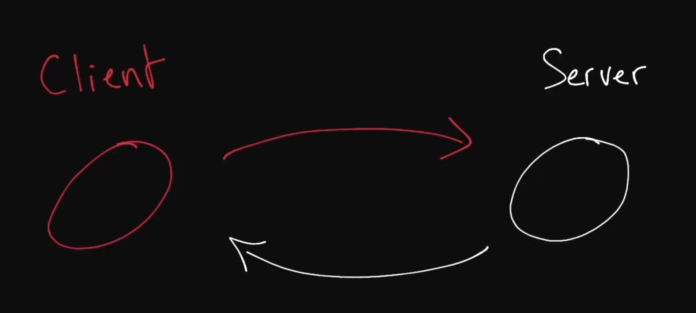

# Design Fundamentals

In an intereview, The candidate has to covert the two word question like "Design Uber" into a 45 minute ansswer by asking and engaging different questions etc.

# Client-Server Model

In basic terms, Client is a machine that speaks with a server and server responds back to client by sending data.

